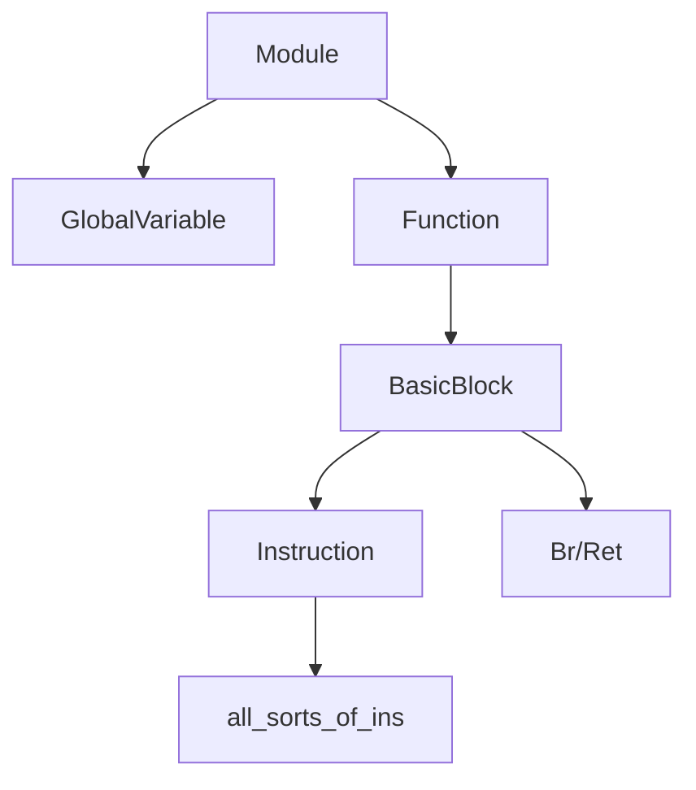

## 中间代码接口

#### IR

* 采用三地址的方式
  * %2=add i32 %0,%1
* SSA+无限寄存器
* 强类型系统
  * i1
  * int
  * pointer
  * label
  * functiontype

在这一阶段尽量和LightIR保持一致

#### C++ API



#### Module

* 含义：一个编程单元
* 成员：
  * function_lists 函数列表，记录了整个程序包含哪些函数
  * global_vars 全局变量列表，记录了程序声明了哪些全局变量
  * instr_name 所有函数的字符串名字（简化输出IR的流程）
  * module基本类型（i32,i1）
* API：

``` C++
Type *get_void_type(); //获取类别的三个函数
Type *get_int_type();
Type *get_bool_type();

void add_function(); //添加函数/全局变量
void add_global_var();

std::list<GlobalVariable *>get_global_variable(); //获取全局变量列表
std::string get_instr_name(Instruction::OpID oprand); //获取中间代码名称
void set_print_name();
```

#### Type

#### Value

#### Instruction

#### GlobalVariable

#### Function

#### Constant

#### BasicBlock