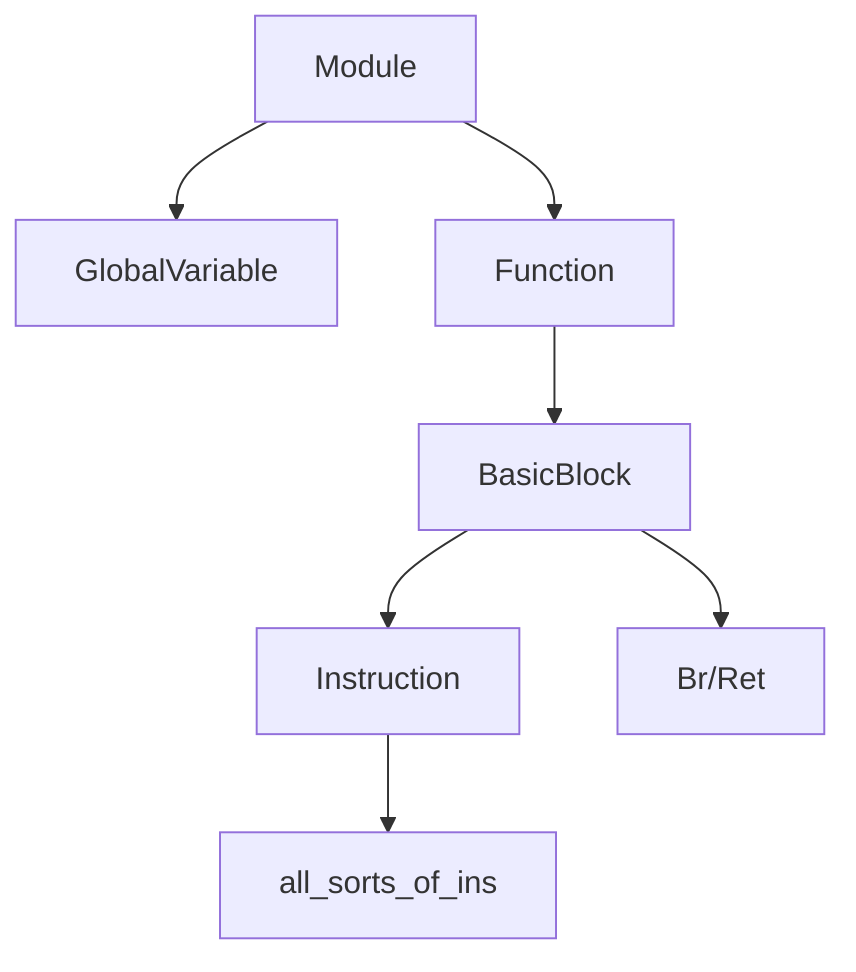

## 中间代码接口

#### IR

* 采用三地址的方式
  * %2=add i32 %0,%1
* SSA+无限寄存器
* 强类型系统
  * i1
  * int
  * pointer
  * label
  * functiontype

在这一阶段尽量和LightIR保持一致

#### C++ API



#### Module

* 含义：一个编程单元
* 成员：
  * function_lists 函数列表，记录了整个程序包含哪些函数
  * global_vars 全局变量列表，记录了程序声明了哪些全局变量
  * instr_name 所有函数的字符串名字（简化输出IR的流程）
  * module基本类型（i32,i1）
* API：

``` C++
Type *get_void_type(); //获取类别的三个函数
Type *get_int_type();
Type *get_bool_type();

void add_function(); //添加函数/全局变量
void add_global_var();

std::list<GlobalVariable *>get_global_variable(); //获取全局变量列表
std::string get_instr_name(Instruction::OpID oprand); //获取中间代码名称
void set_print_name();
```

#### Type

* 含义：某个元素的类型
* 成员：
  * type_id 类型名，记录了某个元素的类型
* API：

``` C++
TypeID get_TypeID(); //获得TypeID
bool is_Void_type(); //判断类型函数
bool is_Lable_type();
bool is_Integer_type();
bool is_Function_type();
bool is_Array_type();
bool is_Pointer_type();
static Type *get_Void_type(Module *m); //获得某个类型
static Type *get_Lable_type(Module *m);
static IntegerType *get_Int32_type(Module *m);
static IntegerType *get_Int32Ptr_type(Module *m);
Type *get_PtrElement_type();
```

* 子类：
	* IntegerType：
		* 成员： 
			* num_bits_ 整型长度
		* API：
		
		``` C++ 
		unsigned get_num_bits_()； //获得整型长度
		static IntegerType *get(unsigned num_bits)； //获取整型
		```

	* FunctionType：
		* 成员： 
			* return_ 返回值
			* args_ 参数表
		* API：

		``` C++ 
		check_return_type(Type *type); //检验参数与返回值类型是否正确
		check_arguement_type(Type *type);
		static FunctionType *get(Type *result, std::vector<Type *> args); //获取函数
		unsigned get_args_num(); //获取参数数目
		Type *get_args_type(unsigned i); //获得参数类型
		Type *get_return_type(unsigned i); //获得返回值类型
		```
 
	* ArrayType：
		* 成员：
			* contained_ //数组成员数据类型
			* num_elements_ //数组成员数
		* API：

		``` C++ 
		static bool  check_element_type(Type  type); //检验数组成员类型是否正确
		static ArrayType *get(Type *contained, unsigned num_elements); //获得数组
		Type *get_element_type()； //获得数组成员类型
		unsigned get_elements_num()； //获得数组成员数
		std::vector<unsigned> get_Dims(); //获得数组维数信息
		```
 
	* PointerType：
		* 成员：contained_ //指针指向的数据类型
		* API：

		``` C++ 
		static PointerType *get(Type contained); //获取指针
		Type *get_element_type()； //获取指针指向的数据类型
		```

#### Value

#### Instruction

#### GlobalVariable

#### Function

#### Constant

#### BasicBlock