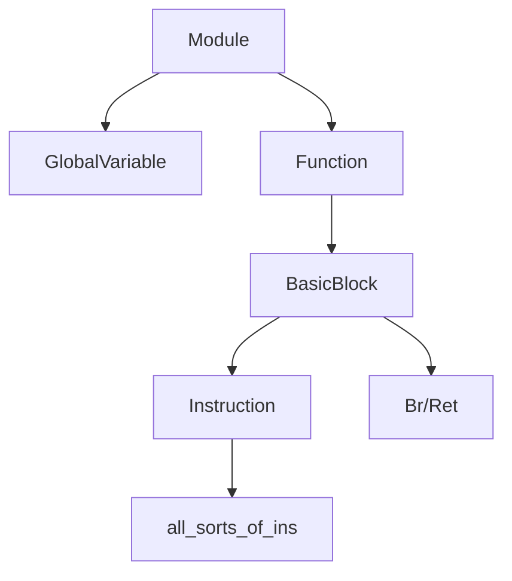

## 中间代码接口

#### IR

* 采用三地址的方式
  * %2=add i32 %0,%1
* SSA+无限寄存器
* 强类型系统
  * i1
  * int
  * pointer
  * label
  * functiontype

在这一阶段尽量和LightIR保持一致

#### C++ API



#### Module

* 含义：一个编程单元
* 成员：
  * function_lists 函数列表，记录了整个程序包含哪些函数
  * global_vars 全局变量列表，记录了程序声明了哪些全局变量
  * instr_name 所有函数的字符串名字（简化输出IR的流程）
  * module基本类型（i32,i1）
* API：

``` C++
Type *get_void_type(); //获取类别的三个函数
Type *get_int_type();
Type *get_bool_type();

void add_function(); //添加函数/全局变量
void add_global_var();

std::list<GlobalVariable *>get_global_variable(); //获取全局变量列表
std::string get_instr_name(Instruction::OpID oprand); //获取中间代码名称
void set_print_name();
```

#### Type

* 含义：某个元素的类型
* 成员：
  * type_id 类型名，记录了某个元素的类型
* API：

``` C++
TypeID get_TypeID(); //获得TypeID
bool is_Void_type(); //判断类型函数
bool is_Lable_type();
bool is_Integer_type();
bool is_Function_type();
bool is_Array_type();
bool is_Pointer_type();
static Type *get_Void_type(Module *m); //获得某个类型
static Type *get_Lable_type(Module *m);
static IntegerType *get_Int32_type(Module *m);
static IntegerType *get_Int32Ptr_type(Module *m);
Type *get_PtrElement_type();
```

* 子类：
	* IntegerType：
		* 成员： 
			* num_bits_ 整型长度
		* API：
		
		``` C++ 
		unsigned get_num_bits_()； //获得整型长度
		static IntegerType *get(unsigned num_bits)； //获取整型
		```

	* FunctionType：
		* 成员： 
			* return_ 返回值
			* args_ 参数表
		* API：

		``` C++ 
		check_return_type(Type *type); //检验参数与返回值类型是否正确
		check_arguement_type(Type *type);
		static FunctionType *get(Type *result, std::vector<Type *> args); //获取函数
		unsigned get_args_num(); //获取参数数目
		Type *get_args_type(unsigned i); //获得参数类型
		Type *get_return_type(unsigned i); //获得返回值类型
		```

	* ArrayType：
		* 成员：
			* contained_ //数组成员数据类型
			* num_elements_ //数组成员数
		* API：

		``` C++ 
		static bool  check_element_type(Type  type); //检验数组成员类型是否正确
		static ArrayType *get(Type *contained, unsigned num_elements); //获得数组
		Type *get_element_type(); //获得数组成员类型
		unsigned get_elements_num(); //获得数组成员数
		std::vector<unsigned> get_Dims(); //获得数组维数信息
		```

	* PointerType：
		* 成员：
			* contained_ //指针指向的数据类型
		* API：

		``` C++ 
		static PointerType *get(Type contained); //获取指针
		Type *get_element_type(); //获取指针指向的数据类型
		```

#### Value

* 含义：变量
* 成员：
  * type 类型变量指针
  * use_list_ 变量调用表，谁使用了这个变量
  * name_ 变量名
* API：

``` C++
Type *getType(); //获得变量类型
std::list<Use> &get_use_list(); //获得调用表
void add_use(Value *val, unsigned arg_no = 0); //增加调用者
void remove_use(Value *val, unsigned arg_no); //删除调用者
void replace_use_list(Value *new_val); //更换调用表
bool set_name(std::string name); //变量命名
std::string get_name(); //获取变量名
```

#### Instruction

* 成员：
  * parent 指令所属的basicblock
  * op_id 指令的编号
  * num_ops 指令的操作数个数
* 子类：
  * BinaryInst 双目运算符
  * 其他子类和LightIR所有指令一一对应
* API：
  * Builder来添加指令

#### GlobalVariable

* 含义：全局变量
* 成员：
  * is_const_ 是否为常值
  * init_val_ 变量指针
* API：

``` C++
Constant *get_Init(); //获得全局变量
static GlobalVariable *create(std::string name, Module *m, Type *type, bool is_const, Constant *init); //创建全局变量
```

#### Function

* 含义：一个函数
* 成员
  * function_type 函数类型
  * function_id 函数名称
  * function_vars 函数参数表
  * basic_blocks 基本块列表
  * arguments_ 行参列表
  * parent_ 函数所处于的module
* API:

```c++
static Function *create_function(std::string id, Module *m, Type *type, vector args_);
FunctionType *get_function_type() const;
Type *get_return_type() const;
void add_basic_block(BasicBlock *bb);
unsigned get_num_of_args() const;
unsigned get_num_basic_blocks() const;
Module *get_parents() const;
std::list<Argument *>::iterator arg_begin();
std::list<Argument *>::iterator arg_end();
void remove(BasicBlock *bb);
std::list<BasicBlock *> &get_basic_blocks();
std::list<Argument *> &get_args();
void set_instr_name();
```


#### Constant

* 含义：常值
* 子类；
	* ConstantInt：
		* 成员：
			* value_ 整型常值
		* API：

		``` C++
		static int getValue(ConstantInt *const_val); //获得整型值
  		int getValue();
  		void setValue(int val); //赋值
  		static ConstantInt *get(int val, Module *m); //获得目标整型常值
		```

	* ConstantArray：
		* 成员：
			* std::vector<Constant *> const_array;
		* API：
		
		``` C++
		unsigned get_elements_num(); //获得数组成员数
		static ConstantArray *get(ArrayType *ty, const std::vector<Constant *> &val); //获得常值数组
		```

#### BasicBlock

* 含义：基本块，是一个单入单出的基本块
* 成员
  * Instr_list 指令链表
  * pre_basic_blocks 前驱bb
  * succ_basic_block 后继bb
* API

```c++
static BasicBlock *create(Module *m, const std::string &name, Function *parent);
Function *get_parent();
Module *get_module();
Instruction *get_terminator(); //return the last instr is ret/br or not
void push_back_instruction(Instruction *instr); //push instr into the back of the list
void push_front_instruction(Instruction *instr); //push instr into the front of the list
void delete_instruction(Instruction *instr); //delete instr and keep the use list
bool is_empty();
int get_num_of_instr();
std::list<Instruction *> &get_instructions();
void erase_from_parents();

std::list<BasicBlock*> &get_pre_basic_blocks();
std::list<BasicBlock*> &get_succ_basic_blocks();
void add_pre_basic_block(BasicBlock *bb);
void add_succ_basic_block(BasicBlock *bb);
void del_pre_basic_block(BasicBlock *bb);
void del_succ_basic_block(BasicBlock *bb);
```

